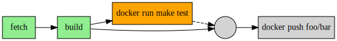

# OCurrent (for demo)

OCurrent allows you to specify a workflow / pipeline for keeping things up-to-date.

  

For example, the pipeline shown above fetches the head of a GitHub repository's
`master` branch, builds it, runs the tests, and deploys the binary if the tests
pass. When a new commit is pushed, it runs the pipeline again.

Another use might be to keep the GitHub build status of each PR in your Git
repository showing the result of fetching, building and testing the PR's head
commit. If the head commit changes, the result must be recalculated.

An OCurrent pipeline is written using an OCaml eDSL. When OCurrent evaluates it,
it records the inputs used (e.g. the current set of open PRs and the head of each
one), monitors them, and automatically recalculates when an input changes.

Larger uses of OCurrent include the
[OCaml Docker base image builder][docker-base-images] and
[ocaml-ci][], which is the CI that tests this repository itself.

## Documentation

The [OCurrent wiki][] contains user documentation and examples.
In particular, you might like to start by reading about the
[example pipelines][] or how to [write your own plugins][writing-plugins].

For technical docs, see the [API Documentation][].

## Licensing

OCurrent is licensed under the Apache License, Version 2.0.
See [LICENSE][] for the full license text.

[docker-base-images]: https://github.com/ocurrent/docker-base-images
[ocaml-ci]: https://github.com/ocurrent/ocaml-ci/
[writing-plugins]: https://github.com/ocurrent/ocurrent/wiki/Writing-plugins
[example pipelines]: https://github.com/ocurrent/ocurrent/wiki/Example-pipelines
[OCurrent wiki]: https://github.com/ocurrent/ocurrent/wiki
[API Documentation]: https://ocurrent.github.io/ocurrent/index.html
[LICENSE]: ./LICENSE
