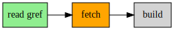
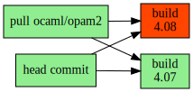

OCurrent allows you to specify a workflow / pipeline for keeping things up-to-date.

<p align='center'>
  
</p>

Status: **experimental / prototyping**

For example, the pipeline shown about fetches the head of a GitHub repository's
`master` branch, builds it, runs the tests, and deploys the binary if the tests
pass. When a new commit is pushed, it runs the pipeline again.

Another use might be to keep the GitHub build status of each PR in your Git
repository showing the result of fetching, building and testing the PR's head
commit. If the head commit changes, the result must be recalculated.

An OCurrent pipeline is written using an OCaml eDSL. When OCurrent evaluates it,
it records the inputs used (e.g. the current set of open PRs and the head of each
one), monitors them, and automatically recalculates when an input changes.

### Example 1 : `docker_build_local.ml`

[docker_build_local.ml][] contains a simple example pipeline:

```ocaml
(* Run "docker build" on the latest commit in Git repository [repo]. *)
let pipeline ~repo () =
  let src = Git.Local.head_commit repo in
  let image = Docker.build src in
  Docker.run image ~args:["dune"; "exec"; "--";
                          "examples/docker_build_local.exe"; "--help"]
```

This monitors a local Git repository (`repo`), from which it gets the current head commit.
It copies it to a temporary clone and builds it with `docker build /path/to/clone`, then
executes the example with `--help` to check that it runs.

You can test it using a clone of the OCurrent repository itself:

```bash
$ git clone https://github.com/talex5/ocurrent.git
$ cd ocurrent/
$ dune exec -- ./examples/docker_build_local.exe .
[...]
    current [INFO] Evaluation complete:
                     Result: Pending
                     Watching: [/home/user/ocurrent/#refs/heads/master;
                                HEAD(/home/user/ocurrent/)]
[...]
current.docker [INFO] Build of docker image "build-of-d75e33fd875d80cd8e0cddf83904dd6d7aea12d3" succeeded
[...]
    current [INFO] Evaluation complete:
                     Result: Ok ()
                     Watching: [/home/user/ocurrent/#refs/heads/master;
                                HEAD(/home/user/ocurrent/)]
```

If you make a new commit or change branch (e.g. `git checkout -b test HEAD~1`) then OCurrent will
notice and build it again.

The example code above works mostly with values of type `'a Current.t`.
For example, `Docker.build` takes a source current and returns a Docker image current.
If you have a function that works on concrete values then you can use `Current.map`
(or the `let+` syntax) to make it work on currents instead.

You can also use `Current.bind` (or the `let*` syntax) if you can only decide
what the next part of the pipeline should be by looking at a concrete input.
However, using `bind` limits OCurrent's ability to analyse the pipeline,
because it must wait for the input to be ready before knowing what happens
next.

### Generating a dot graph of the pipeline

OCurrent can generate a graph showing the current state of the pipeline.
The example code wraps the previous `pipeline` like this:

```ocaml
let dotfile = Fpath.v "pipeline.dot"

(* Render pipeline as dot file *)
let pipeline ~repo () =
  let result = pipeline ~repo () in
  let dot_data =
    let+ a = Current.Analysis.get result in
    Fmt.strf "%a" Current.Analysis.pp_dot a
  in
  let* () = Current_fs.save (Current.return dotfile) dot_data in
  result
```

This causes it to maintain also a `pipeline.dot` file showing the current state
of the pipeline.

Note the use of `let+` to convert an `Analysis.t Current.t` to a `string Current.t`,
and `let*` to allow us to return the pipeline `result` (which might be pending or failed,
rather than a concrete value).

You can turn the dot file into e.g. SVG with `dot -Tsvg pipeline.dot  -o pipeline.svg`:

<p align='center'>
  
</p>

A green box indicates a pipeline stage that succeeded, orange means
in-progress, grey means cannot be started yet, and red means failed.

OCurrent has a small core language (in `lib` and `lib_term`), but most
functionality is added by external libraries. See the [plugins][] directory for
some examples.

### Example 2 : `build_matrix.ml`

[build_matrix.ml][] contains a slightly more advanced pipeline:

<p align='center'>
  
</p>

```ocaml
let weekly = Current_cache.Schedule.v ~valid_for:(Duration.of_day 7) ()

(* Run "docker build" on the latest commit in Git repository [repo]. *)
let pipeline ~repo () =
  let src = Git.Local.head_commit repo in
  let base = Docker.pull ~schedule:weekly "ocaml/opam2" in
  let build ocaml_version =
    let dockerfile =
      let+ base = base in
      dockerfile ~base ~ocaml_version
    in
    Docker.build ~label:ocaml_version ~pull:false ~dockerfile src |>
    Docker.tag ~tag:(Fmt.strf "example-%s" ocaml_version)
  in
  Current.all [
    build "4.07";
    build "4.08"
  ]
```

The `Docker.pull` step shows the use of a *schedule*. In this case, we consider
a pulled image to be valid for one week; after that OCurrent will automatically
run the `docker pull` again to check for newer versions.

It uses `Current.all` to build against different versions of OCaml, generating
a suitable Dockerfile for each version (the `ocaml/opam2` image contains multiple
versions of the compiler and the Dockerfile just selects one of them).

The generated images are then tagged with the compiler version used to build them.

### Writing your own plugins

To create your own primitive operations (such as `Docker.build`), you'll probably want to use the [Current_cache][] library.
This handles all the details of starting builds, recording the results, managing log files, etc.

A minimal example looks something like this:

```ocaml
open Current.Syntax

module Frob = struct
  type t = No_context

  module Key = Current.String
  module Value = Current.String

  let id = "frob"

  let build ~switch No_context job key =
    Lwt.return @@ Ok "done"

  let pp f key = Fmt.pf f "frob %a" Key.pp key

  let auto_cancel = false

  let level _ _ = Current.Level.Harmless
end

module FC = Current_cache.Make(Frob)

let frob key =
  "Frob" |>
  let** key = key in
  FC.get Frob.No_context key
```

The `frob` function is the one exposed to users.
These functions always start by getting the actual values
from their `Current.t` arguments using `let**` (and `and*`, for additional arguments).
The label is used for the dot diagrams.

The `build` function does the real work.
It should try to build the output value from the key and return it.
If `switch` is turned off, you should try to cancel the operation.
`job` can be used for logging.

If you need extra context that shouldn't be part of the key
(e.g. ssh keys used to connect to a remote machine)
then you can use the `t` type for that, replacing `No_context` with whatever you require.
Note that asking for the same key with two different contexts will *not* perform two different builds.

The `Key` module describes the type of the inputs.
It needs to provide a `digest` function for turning keys into unique strings.
For short strings, you can just use the string itself (this is what `Current.String` does).
For longer data, you might want to generate a SHA hash.
For complex data types, you might want to convert to JSON, etc.

The `Value` module describes the outputs.
You need to provide `marshal` and `unmarshal` functions for storing the results on disk.
Note that for large values you can write the data elsewhere and just use its identifier as the value.
For example, the value returned by `Docker.build` is just the image's tag.
The image itself is stored by Docker.

`auto_cancel` says whether OCurrent should turn off the switch automatically if the build is no longer
needed. For example, if you're building a Git commit and then the user makes another commit, you can decide
whether it would be better to continue with the old build (while also building the new commit), or abort it.

`level` gives a rough estimate of the cost or risk of the operation.
You can use the `--confirm` option to decide which operations OCurrent will perform automatically.

See the [Current_cache][] API for more information.

### The build cache

When run, OCurrent keeps its state in `./var` (creating it if it doesn't already exist).
The layout is subject to change, but for debugging purposes:

- `var/job/$date/$time-$name-$random.log` is used for build logs.
- `var/db` contains an sqlite database recording completed builds and their results.
- `var/git/$repo-$hash` is used by the Git plugin as a local Git clone for a remote repository.

For debugging, you can query the build cache (even while OCurrent is running) like this:

```
$ sqlite3 var/db/sqlite.db
sqlite> SELECT key, log, ok, value FROM build_cache WHERE builder='docker-build' ORDER BY finished;
```

Here, `key` is the Git commit that was built, `log` is the relative path of the build log, `ok` indicates whether the build passed,
and `value` is the resulting Docker image (or the error message, if `ok` is false).

### TODO

OCurrent is very incomplete at the moment (but is being actively developed, as of June 2019).
Planned/missing features include:

- Integration with GitHub, not just local repositories.
- A web-based UI.
- Cap'n Proto RPC, to allow remote control.

[Current_cache]: https://github.com/talex5/ocurrent/blob/master/lib_cache/current_cache.mli
[build_matrix.ml]: https://github.com/talex5/ocurrent/blob/master/examples/build_matrix.ml
[docker_build_local.ml]: https://github.com/talex5/ocurrent/blob/master/examples/docker_build_local.ml
[plugins]: https://github.com/talex5/ocurrent/blob/master/plugins
